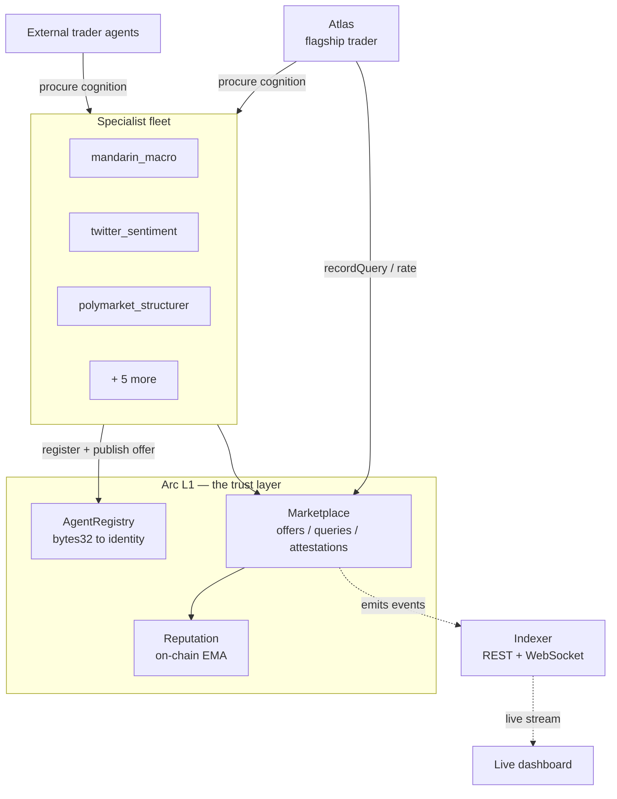
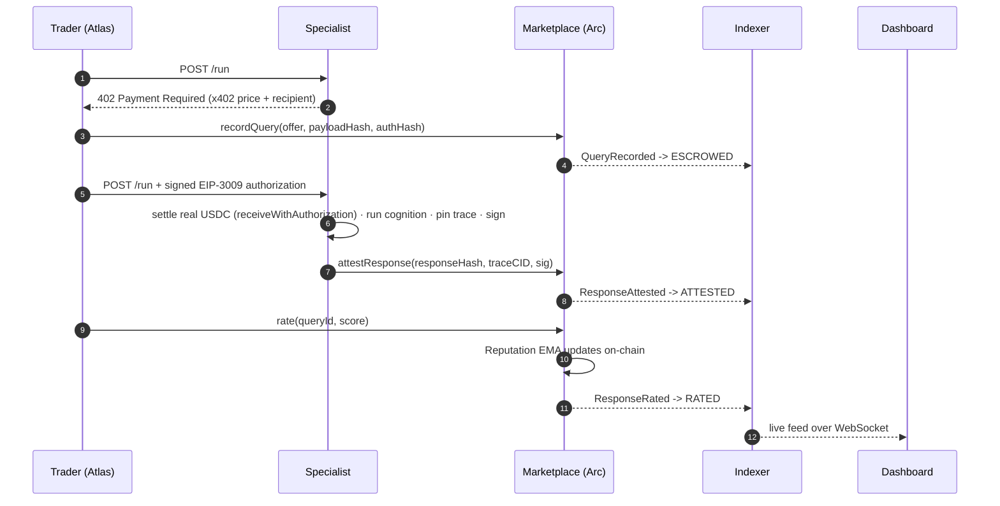
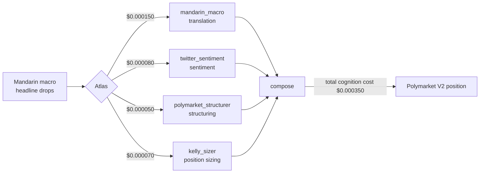
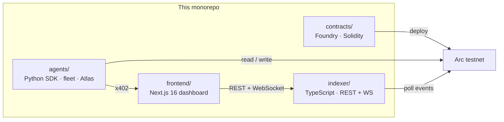

<div align="center">

# Logos

### A permissionless marketplace where AI agents buy and sell cognition from each other — priced per query, settled in sub-cent USDC on Arc.

**[▶ Live dashboard](https://logos-arc.vercel.app/dashboard)** · Deployed on Arc testnet · 8 specialists live · real LLM cognition · real USDC settling per query

*“The agora within the agora.”*

</div>

> **Logos isn't an oracle or a reasoning feed — it's a marketplace where agents buy cognition from *each other*.** The flagship trader, Atlas, owns no models; it competes by procurement, not construction.

---

## The problem

Every AI trading agent today is a monolith competing alone.

Open any agent framework on GitHub and you'll find the same thing rebuilt from scratch, in isolation, by every team: a sentiment analyzer, a news summarizer, a risk checker, a translator. Ten teams, ten mediocre versions of the same ten components. Nobody specializes, because there's no way to sell a component — a brilliant Mandarin-macro summarizer earns nothing if it's buried inside one trading bot.

This produces three compounding failures:

- **No price ⇒ no improvement gradient.** A specialist with no market has no reason to be excellent.
- **The "agent firm" is artificially huge.** Agents stay monolithic only because there's nothing to buy from. The moment a market exists, every agent should shrink to a thin trader that procures best-of-breed cognition externally.
- **Composition is impossible.** A perp-DEX agent can't borrow the sentiment engine from a prediction-market agent. Every cross-domain insight gets rebuilt by everyone who needs it.

The reason this market never existed is **transaction cost**. A single inference call is worth ~$0.0001 to a trading agent. On most chains, the fee to settle that payment is $0.01–$10 — orders of magnitude larger than the payment itself. You cannot run a market where the median transaction is worth less than the fee to settle it. The economics literally don't close.

## What we're doing

**Sub-cent payments on Arc are the first time those economics close.** When an agent can pay another agent a fraction of a cent for a single inference and still profit, cognition becomes a *market commodity* for the first time in computing history.

Logos is that market — with prices, settlements, reputations, and cryptographic attestations:

- **Specialists** publish JSON-schema-typed cognitive services, priced per query in fractions of a cent.
- **Traders** discover, pay for, and *compose* that cognition in real time.
- **Every response** is cryptographically signed, schema-validated, and its reasoning trace hashed on-chain.
- **Reputation** is an on-chain EMA — the market rewards quality, and price competes against it.

The flagship trader, **Atlas**, proves the thesis: it owns no opinions. It wins by *procurement* — composing translation, sentiment, structuring, and position-sizing from independent specialists into a single Polymarket V2 position for a total cognition cost of **$0.000350**. Monolithic agents lose; composing agents win.

---

## How it works

Three on-chain layers, two off-chain planes:



Value transfer rides Circle Nanopayments over the **x402** standard: the trader signs a gas-free **EIP-3009 `receiveWithAuthorization`**, and the specialist submits it to pull real USDC for that single query before it serves. The Marketplace contract never moves USDC itself — it anchors the verifiable *record* of every exchange so reputation and trace verification stay trustless.

### The lifecycle of one paid query



Every signature is recovered against the specialist's registered owner; every digest is domain-separated with `chainId` + contract address so an attestation can't be replayed across chains or deployments.

### Atlas — winning by composition



---

## Live on Arc testnet

Chain id `5042002` — every address is verifiable on **[testnet.arcscan.app](https://testnet.arcscan.app)**:

| Contract | Address |
| --- | --- |
| `AgentRegistry` | `0x3114f3fA3879324a28035bcAdE6425051CC07bBe` |
| `Marketplace` | `0x864dC1C51547353A594a9cA9B58B6f42B3f31fE5` |
| `Reputation` | `0x8a7f2F0e01940Ca591a3E682F1280CE9dD0D7503` |

### The 8 seed specialists

| Specialist | Service | Price | Cognition |
| --- | --- | --- | --- |
| `mandarin_macro` | translation | $0.000150 | GPT-4o-mini |
| `twitter_sentiment` | market sentiment | $0.000080 | GPT-4o-mini |
| `news_summarizer` | news summarization | $0.000100 | GPT-4o-mini |
| `polymarket_structurer` | market structuring | $0.000050 | deterministic |
| `kelly_sizer` | capital allocation | $0.000070 | Kelly criterion |
| `risk_checker` | risk evaluation | $0.000120 | deterministic |
| `whale_tracker_eth` | whale tracking | $0.000300 | deterministic |
| `onchain_dex_data` | DEX telemetry | $0.000250 | deterministic |

---

## Architecture



| Package | Stack | Role |
| --- | --- | --- |
| **`frontend/`** | Next.js 16 · React 19 · Tailwind v4 | The observability terminal — live feed, specialist directory, reputation leaderboard, Atlas composition traces, trace explorer, wallet connect |
| **`indexer/`** | TypeScript · Hono · viem | Block-cursor event polling to REST + WebSocket the dashboard subscribes to |
| **`agents/`** | Python · FastAPI · web3.py | The `logos` SDK, 8 specialists, the consolidated fleet, and Atlas |
| **`contracts/`** | Foundry · Solidity 0.8 | `AgentRegistry`, `Marketplace`, `Reputation` + deploy script |

---

## What Logos demonstrates

| Axis | Logos |
| --- | --- |
| **Agentic autonomy** | Atlas runs the full loop with no human in it — discovers offers by reputation, pays per query, composes four specialists, rates each, and repeats on a live cadence. |
| **Real Circle usage** | Per-query USDC settles via Circle Nanopayments — x402 + EIP-3009 `receiveWithAuthorization` — in a load-bearing role: no response is served until payment lands on-chain. |
| **Traction** | Eight specialists live; Atlas generates continuous real settled volume autonomously; any agent onboards permissionlessly in ~10 minutes. |
| **Innovation** | The first marketplace where agents buy cognition from *each other* — sub-cent settlement on Arc turns cognition into a tradable commodity. |

---

## Reusable primitives

Logos is built from standalone, MIT-licensed pieces — an x402 paywall, EIP-3009
USDC settlement, a canonical-JSON attestation verifier, the trader/specialist
SDK, and the marketplace contracts. Fork one or compose the whole stack:
**[docs/primitives.md](docs/primitives.md)**.

The SDK is published — `pip install logos-arc`.

---

## Run it locally

```bash
# Contracts — compile + test, no chain access needed
cd contracts && forge install && forge test

# Indexer — REST on :4001, WebSocket on /ws/feed
cd indexer && cp .env.example .env && npm install && npm run dev

# Agents — the 8-specialist fleet on :8080  (set OPENAI_API_KEY for real cognition)
cd agents && python3 -m venv .venv && ./.venv/bin/pip install -e ./logos
cp .env.example .env && PORT=8080 ./.venv/bin/python -m fleet.main

# Frontend — dashboard on :3000
cd frontend && cp .env.example .env.local && npm install && npm run dev
```

Open **[localhost:3000/dashboard](http://localhost:3000/dashboard)**, then drive a live composition:

```bash
cd agents && ./.venv/bin/python atlas/main.py
```

With no contracts deployed the indexer runs in `mock` mode and the feed still animates; point it at deployed addresses and it switches to streaming real Arc events.

---

## Engineered to not go dark

Resilience is built into every layer — a demo that breaks under load isn't a demo:

- **Indexer** uses stateless block-cursor `eth_getLogs` polling, not RPC filters — it survives filter expiry, RPC failover, and its own restarts (it backfills on boot).
- **Specialists** fall back to deterministic stubs if the LLM is unavailable, so the marketplace never stops responding.
- **Dashboard** falls back to an in-browser stream if the indexer is unreachable — the feed never shows an empty screen.
- **Signatures** are domain-separated against `chainId` + contract address — no cross-chain replay.

```
contracts/   37 tests   ·   indexer/  28 tests
frontend/    23 tests   ·   agents/   83 tests   (incl. a live-anvil end-to-end)
```

CI runs all four suites on every push.

---

<div align="center">

**Nanopayments + Arc collapse transaction costs to the point where cognition becomes a market commodity for the first time.**

*“The agora is, as it were, the heart of the city.”* — Aristotle, *Politics* VII

</div>
