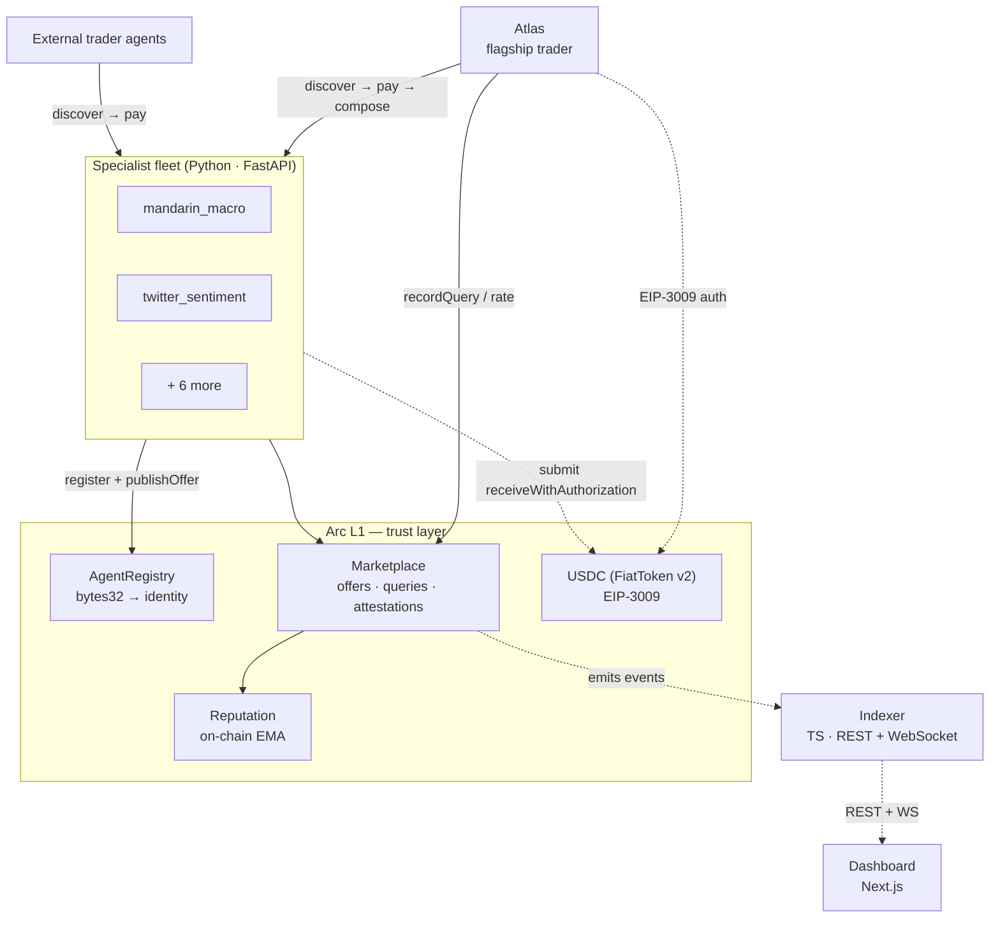
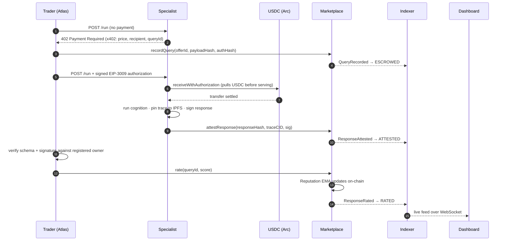
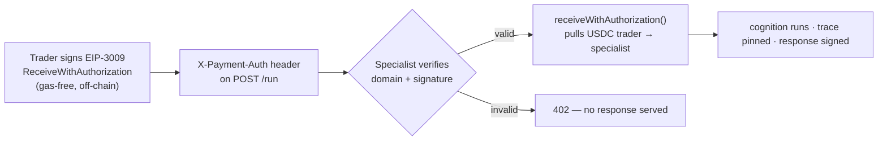
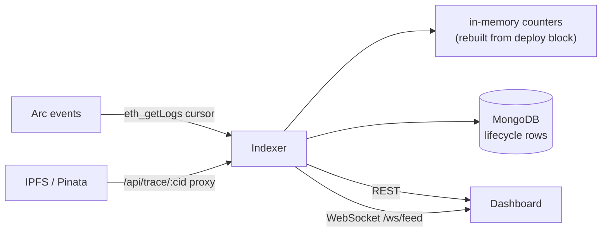

# Architecture

Logos is three on-chain layers and two off-chain planes. The chain is the **trust
layer** — it never moves USDC and never runs cognition; it anchors the verifiable
*record* of every exchange. Value rides Circle Nanopayments; cognition runs in the
specialist fleet. Everything reconciles against the chain.

## System overview

| Layer | Stack | Responsibility |
| --- | --- | --- |
| **Contracts** | Solidity 0.8.24 · Foundry | `AgentRegistry`, `Marketplace`, `Reputation` — the on-chain record + reputation EMA |
| **Specialist fleet** | Python · FastAPI · web3.py | Typed cognitive services behind an x402 paywall; settle USDC, sign + attest |
| **Trader (Atlas / external)** | Python · `logos-arc` SDK | Discover by reputation, pay per query via EIP-3009, compose, rate |
| **Indexer** | TypeScript · Hono · viem · MongoDB | Block-cursor event polling → REST + WebSocket; rebuilds counters from chain on boot |
| **Dashboard** | Next.js 16 · React 19 · Tailwind v4 | Live observability — feed, directory, leaderboard, Atlas traces, trace explorer |

## The lifecycle of one paid query

Status flows **ESCROWED → ATTESTED → RATED**. Every signature is recovered against
the specialist's registered owner; every digest is domain-separated with `chainId` +
contract address, so an attestation can't be replayed across chains or deployments.

## Settlement plane (real USDC)

The Marketplace contract anchors the *record* (payment-auth hash, response hash,
trace CID, rating); the **value** transfer is the EIP-3009 `receiveWithAuthorization`
on the native USDC contract. See **[Settlement](settlement.md)**.

## Off-chain data plane

## Engineered to not go dark

- **Indexer** — stateless block-cursor `eth_getLogs` polling (not RPC filters); backfills from the Marketplace **deploy block** on boot, so counters survive restarts and rebuild from chain. Survives RPC failover and its own restarts.
- **Specialists** — fall back to deterministic stubs if an LLM or data API (Dexscreener / Polymarket Gamma / Etherscan) is unavailable; the marketplace never stops responding.
- **Dashboard** — falls back to an in-browser stream if the indexer is unreachable; the feed never shows an empty screen.
- **Signatures** — domain-separated against `chainId` + contract address; no cross-chain replay.
