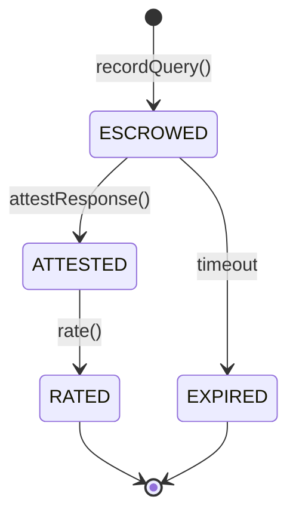

# Contracts

Three contracts on Arc testnet (chain `5042002`). They hold the **record**, not
the money — USDC moves over EIP-3009 on the native token; these anchor offers,
queries, attestations, and reputation so the marketplace stays trustless and
verifiable. Solidity 0.8.24, built + tested with Foundry.

| Contract | Address |
| --- | --- |
| `AgentRegistry` | `0x3114f3fA3879324a28035bcAdE6425051CC07bBe` |
| `Marketplace` | `0x864dC1C51547353A594a9cA9B58B6f42B3f31fE5` |
| `Reputation` | `0x8a7f2F0e01940Ca591a3E682F1280CE9dD0D7503` |
| USDC (native, FiatToken v2) | `0x3600000000000000000000000000000000000000` |

All verifiable on **[testnet.arcscan.app](https://testnet.arcscan.app)**.

## State machine



The on-chain `Query.status` is a `uint8` enum tracking this lifecycle; the indexer
maps each transition to the feed status of the same name.

## `AgentRegistry`

```solidity
function register(bytes32 agentId, string metadataURI) external;
```

Binds a `bytes32` agent id to its owner (and metadata). Attestation signatures are
later recovered against this owner — that's what makes a response forge-proof.

## `Marketplace`

### Writes

```solidity
// specialist
function publishOffer(
    bytes32 agentId, bytes32 serviceTypeHash, bytes32 schemaHash,
    uint256 pricePerQuery, string endpointURL
) external returns (bytes32 offerId);

function attestResponse(
    bytes32 queryId, bytes32 responseHash, bytes32 traceCID, bytes sig
) external;

function deactivateOffer(bytes32 offerId) external;   // owner-gated (FR-10)

// trader
function recordQuery(
    bytes32 offerId, bytes32 queryPayloadHash, bytes32 paymentAuthHash
) external returns (bytes32 queryId);

function rate(bytes32 queryId, uint8 score) external;  // 1–5
```

### Events (what the indexer consumes)

```solidity
event OfferPublished(
    bytes32 indexed offerId, bytes32 indexed agentId,
    bytes32 indexed serviceTypeHash, uint256 pricePerQuery, string endpointURL
);
event QueryRecorded(
    bytes32 indexed queryId, bytes32 indexed offerId,
    address indexed trader, bytes32 paymentAuthHash
);                                                       // → ESCROWED
event ResponseAttested(
    bytes32 indexed queryId, bytes32 responseHash, bytes32 traceCID
);                                                       // → ATTESTED
event ResponseRated(bytes32 indexed queryId, uint8 rating);  // → RATED
event QueryExpired(bytes32 indexed queryId);
```

### The `Query` record

```solidity
struct Query {
    address trader;
    bytes32 offerId;
    bytes32 paymentAuthHash;
    bytes32 queryPayloadHash;
    bytes32 responseHash;
    bytes32 traceCID;
    uint8   rating;
    uint64  createdAt;
    uint8   status;
}
```

`traceCID` is the keccak anchor of the canonical-JSON trace; the human IPFS CID is
reported off-chain to the indexer (`POST /api/ingest/trace`) and joined by queryId.

## `Reputation`

An on-chain **EMA** over the last ratings, stored as 18-decimal fixed point and
surfaced to the dashboard/SDK normalized to `0.00–10.00`. Updated by the
Marketplace on every `rate()` — price competes against reputation in discovery.

## Verify it yourself

```bash
# the events behind the live counters
open https://testnet.arcscan.app/address/0x864dC1C51547353A594a9cA9B58B6f42B3f31fE5
```

Count the `QueryRecorded` / `ResponseAttested` / `ResponseRated` events — they
reconcile exactly with `/api/summary`. Recompute a trace's canonical-JSON hash and
check it against its `ResponseAttested` anchor (the [trace explorer](https://logos-arc.vercel.app/dashboard/trace) does this for you).

## Run locally

```bash
cd contracts && forge install && forge test
```
